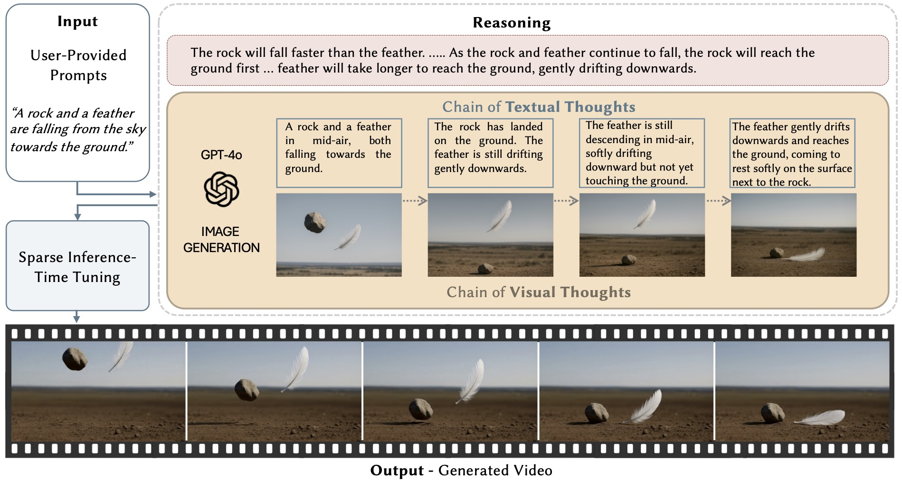
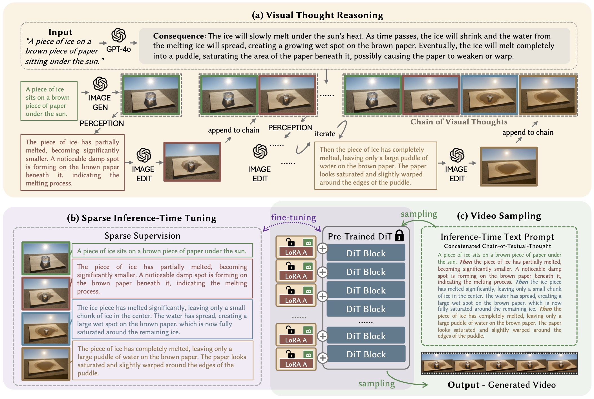

[](https://arxiv.org/abs/2510.xxxxx)
[](https://eyeline-labs.github.io/VChain/) 
[](https://www.youtube.com/watch?v=HV4uAHJwt1k)

<div align="center">
  
# <i style="color:#a9195c">VChain</i>: Chain-of-Visual-Thought for Reasoning in Video Generation

<a href="https://ziqihuangg.github.io" target="_blank">Ziqi Huang</a><sup>1</sup>,
<a href="https://ningyu1991.github.io/" target="_blank">Ning Yu</a><sup>2 ✉ †</sup>,
<a href="https://gordonchen19.github.io" target="_blank">Gordon Chen</a><sup>1</sup>,
<a href="http://haonanqiu.com/" target="_blank">Haonan Qiu</a><sup>1</sup>,
<a href="https://www.pauldebevec.com/" target="_blank">Paul Debevec</a><sup>2</sup>,
<a href="https://liuziwei7.github.io/" target="_blank">Ziwei Liu</a><sup>1 ✉</sup>

<sup>1</sup> Nanyang Technological University &nbsp;&nbsp;&nbsp; <sup>2</sup> Eyeline Labs  
✉ corresponding authors &nbsp;&nbsp;&nbsp; † project lead

</div>

---

## Abstract

Recent video generation models can produce smooth and visually appealing clips, but they often struggle to synthesize complex dynamics with a coherent chain of consequences. Accurately modeling visual outcomes and state transitions over time remains a core challenge. In contrast, large language and multimodal models (e.g., GPT-4o) exhibit strong visual state reasoning and future prediction capabilities. To bridge these strengths, we introduce **VChain**, a novel inference-time *chain-of-visual-thought* framework that injects visual reasoning signals from multimodal models into video generation. Specifically, VChain contains a dedicated pipeline that leverages large multimodal models to generate a sparse set of critical keyframes as snapshots, which are then used to guide the *sparse inference-time tuning* of a pre-trained video generator only at these key moments. Our approach is tuning-efficient, introduces minimal overhead and avoids dense supervision. Extensive experiments on complex, multi-step scenarios show that VChain significantly enhances the quality of generated videos.

---

## VChain Demo

[](https://www.youtube.com/watch?v=HV4uAHJwt1k)

---

## Overview of VChain

We introduce **VChain**, an inference-time tuning framework for reasoning in video generation. Given a user-provided prompt (*e.g.*, *“A rock and a feather are falling from the sky towards the ground.”*), VChain leverages large multimodal models to generate a *Chain of Visual Thoughts*, which are a sparse set of causally important keyframes to guide the video generator via *Sparse Inference-Time Tuning*. VChain effectively improves reasoning in video generation without extensive re-training.

<p align="center">
  <!-- Replace with a PNG/JPG for GitHub preview -->
  
</p>

---

## VChain Framework

An overview of our three-stage inference-time pipeline for reasoning in video generation.  
**(a) Visual Thought Reasoning:** Given a user-provided text prompt, a large multimodal model (GPT-4o) infers a causal chain of events and generates a sequence of keyframes, termed the *Chain of Visual Thoughts*, via iterative reasoning and image synthesis.  
**(b) Sparse Inference-Time Tuning:** These visual thoughts (paired with their corresponding textual thoughts) serve as sparse supervision for fine-tuning a pre-trained video generator via LoRA.  
**(c) Video Sampling:** The full sequence of textual thoughts is concatenated to form a single prompt, which is used to prompt the fine-tuned model in generating the final video output.

<p align="center">
  <!-- Replace with a PNG/JPG for GitHub preview -->
  
</p>

---

## Links

- 📄 **Paper (arXiv):** https://arxiv.org/abs/2510.xxxxx  
- 🌐 **Project Page:** https://eyeline-labs.github.io/VChain/  
- 💻 **Code:** https://github.com/Eyeline-Labs/VChain  
- 🎬 **Video:** https://www.youtube.com/watch?v=HV4uAHJwt1k

---

## Citation

If you find our work useful, please consider citing:

```bibtex
@article{huang2025vchain,
  title={{VChain}: Chain-of-Visual-Thought for Reasoning in Video Generation},
  author = {Huang, Ziqi and Yu, Ning and Chen, Gordon and Qiu, Haonan and Debevec, Paul and Liu, Ziwei},
  journal={arXiv preprint arXiv:2510.xxxxx},
  year={2025}
}
